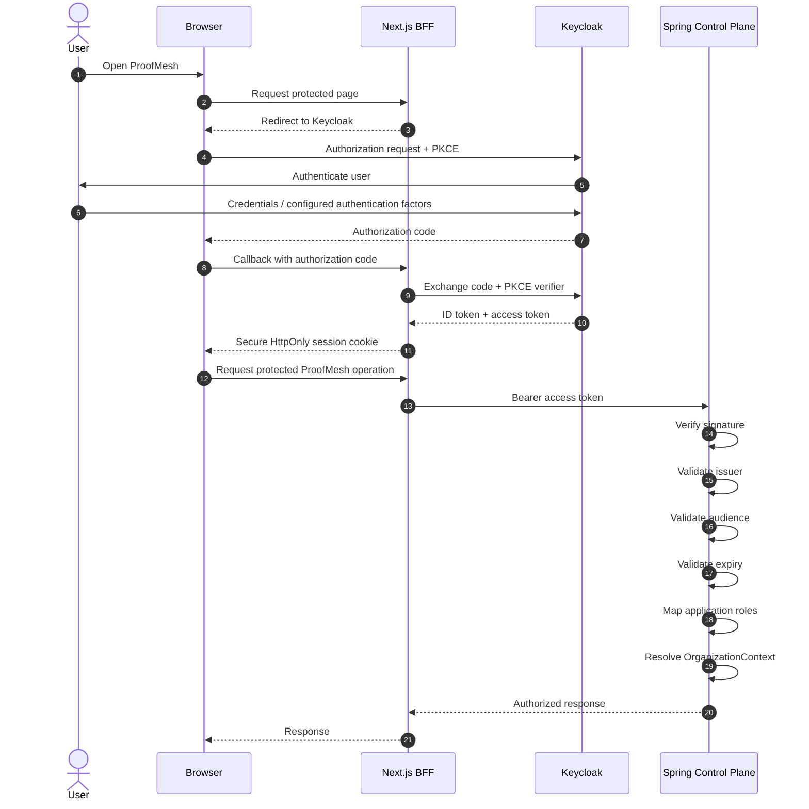
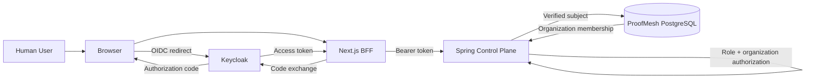
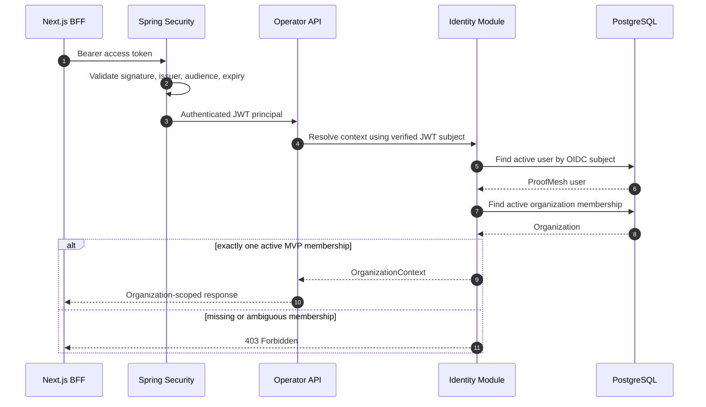

# ProofMesh Identity & Access Design

Status: Accepted for MVP implementation
Date: 2026-08-28

## 1. Human identity model

ProofMesh delegates human authentication to Keycloak through
OpenID Connect.

The control plane does not store or validate human passwords.

Canonical MVP application roles:

- `PLATFORM_ADMIN`
- `APPROVER`
- `SECURITY_OPERATOR`
- `VIEWER`

Authorization remains enforced by the Spring control plane.
Frontend visibility or disabled buttons are not security boundaries.

## 2. Responsibilities

| Component | Responsibility |
|---|---|
| Keycloak | Authenticate human identities and issue OIDC/OAuth2 tokens |
| Next.js BFF | Run Authorization Code + PKCE login and maintain the browser session |
| Spring Control Plane | Validate bearer tokens and enforce application authorization |
| PostgreSQL | Store ProofMesh user-to-organization application context |
| Browser | Holds only the secure application session cookie; control-plane bearer tokens are not intentionally exposed to browser JavaScript |

## 3. Human authentication sequence

## 4. Authorization boundary

## 5. Role authorization

| Role | MVP authority |
|---|---|
| `PLATFORM_ADMIN` | Manage organizations, agents, tools and policy lifecycle |
| `APPROVER` | Review and approve/reject eligible approval requests with rationale |
| `SECURITY_OPERATOR` | Investigate actions/incidents/evidence and perform replay |
| `VIEWER` | Read dashboards and operational details only |

A `VIEWER` must never be able to perform state-changing
approval, policy, registry or incident operations.

## 6. Organization context

ProofMesh does not trust an organization identifier supplied in a URL,
header or request body as proof of tenant membership.

The control plane derives the authenticated user's stable OIDC subject
from the verified token and resolves that subject to a ProofMesh user
and organization membership stored in PostgreSQL.

For the MVP there is one reference organization, but the authorization
model remains organization-aware so later multi-tenancy does not require
redesigning every domain API.

Conceptually:

verified JWT
    -> OIDC subject
    -> ProofMesh user
    -> organization membership
    -> OrganizationContext
    -> organization-scoped application operation

## 7. Trust rules

1. Authentication is delegated to Keycloak.
2. The control plane independently validates access tokens.
3. The BFF is not trusted as the sole authorization boundary.
4. Human actor identity is derived from the verified OIDC identity,
   never from client-supplied actor text.
5. Organization scope is resolved server-side.
6. State-changing operations require explicit server-side role checks.
7. Human and agent identities use different authentication mechanisms.
8. Tokens and secrets must not be written to application logs.

## 8. MVP vs future evolution

MVP:

Keycloak + OIDC + application roles + one organization-aware context.

Later:

enterprise SSO/federation, SCIM provisioning, richer organization
membership, external identity providers and organization-level
authorization administration.

## 9. Organization context resolution

The client may later select an organization, but a client-supplied
organization identifier is never accepted as proof of membership. The
control plane must verify the authenticated subject's membership before
performing organization-scoped operations.